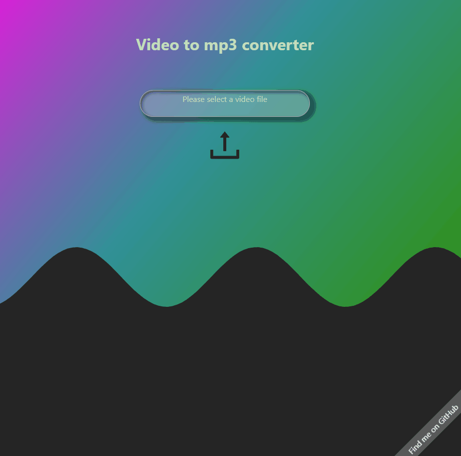

# Video2MP3

## Live Link

* [Video2MP3](https://video2audio.herokuapp.com/)

## The Video2MP3 web application was built with

* React.js
* Javascript
* Node.Js
* Python
* Flask
* MoviePy

## Installation
* clone this repository,
* run `pipenv install --dev -r dev-requirements.txt && pipenv install -r requirements.txt` to install python and flask dependencies
* run `pipenv shell` to enter virtual pip environment and `flask run` to start the flask server.
* In a new terminal `cd react-app && npm install` to change to client directory and install react-app dependencies. 

## What is Video2MP3?

This is a web application dedicated to converting video files from your pc or cellular device into mp3 formatted audio files for download. I created this web application primarily with audio sampling in mind for use in tandem with other applications for music production, however there are plenty of other use cases within education. Record a video of a particularly challenging drum part, extract the audio, and slow down the audio in your favorite audio engineering platform.

## Video2MP3 in action!

## Whats next?

I would like to maintain this app and continue to offer more services such as incorporating python-youtube library, and offer other download formats instead of just MP3. I would also like to create accounts associated with this application so users can access previously converted videos in one convenient location.
